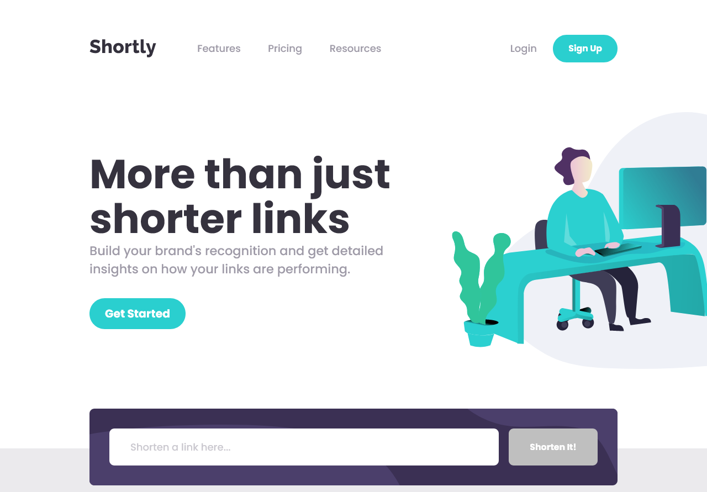

# Frontend Mentor - Shortly URL shortening API Challenge solution

This is a solution to the [Shortly URL shortening API Challenge challenge on Frontend Mentor](https://www.frontendmentor.io/challenges/url-shortening-api-landing-page-2ce3ob-G). Frontend Mentor challenges help you improve your coding skills by building realistic projects.

## Table of contents

- [Overview](#overview)
  - [The challenge](#the-challenge)
  - [Screenshot](#screenshot)
  - [Links](#links)
- [My process](#my-process)
  - [Built with](#built-with)
- [Author](#author)

## Overview

### The challenge

Users should be able to:

- View the optimal layout for the site depending on their device's screen size
- Shorten any valid URL
- See a list of their shortened links
- Copy the shortened link to their clipboard in a single click
- Receive an error message when the `form` is submitted if:
  - The `input` field is empty,
  - The URL is invalid

### Screenshot

### Links

- Solution URL: [Repository](https://github.com/gguilhermelopes/front-end-mentor-url-shortener)
- Live Site URL: [Live URL](https://gguilhermelopes.github.io/front-end-mentor-url-shortener/)

## My process

### Built with

- Semantic HTML5 markup
- CSS custom properties
- Flexbox
- CSS Grid
- [React](https://reactjs.org/) - JS library

## Author

- Website - [portfolio](https://gguilhermelopes.github.io/)
- Frontend Mentor - [@gguilhermelopes](https://www.frontendmentor.io/profile/gguilhermelopes)
- Twitter - [@gguilhermlopes](https://twitter.com/gguilhermlopes)
